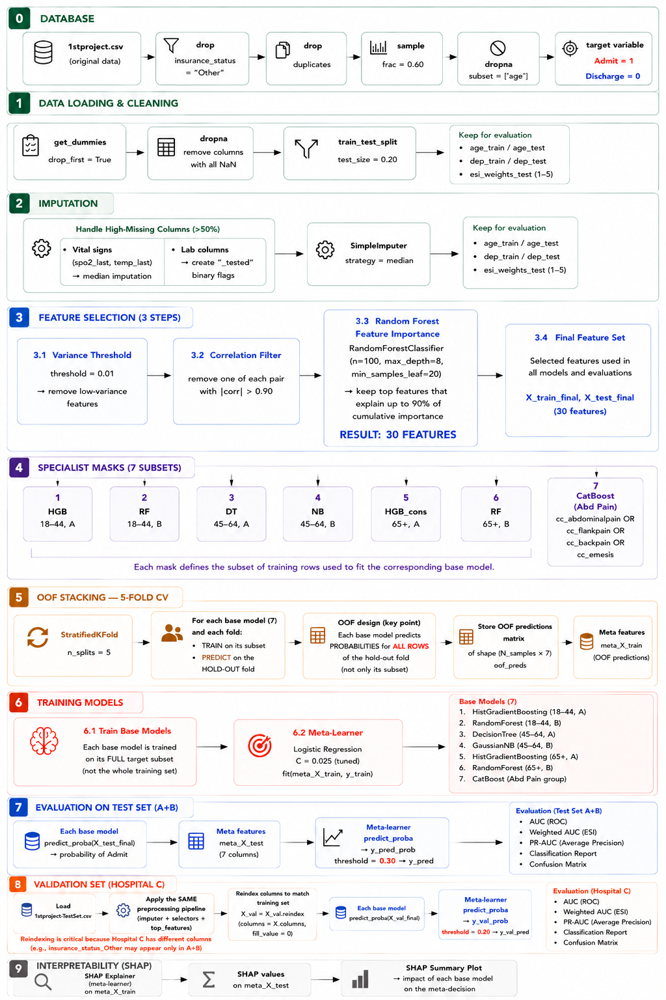
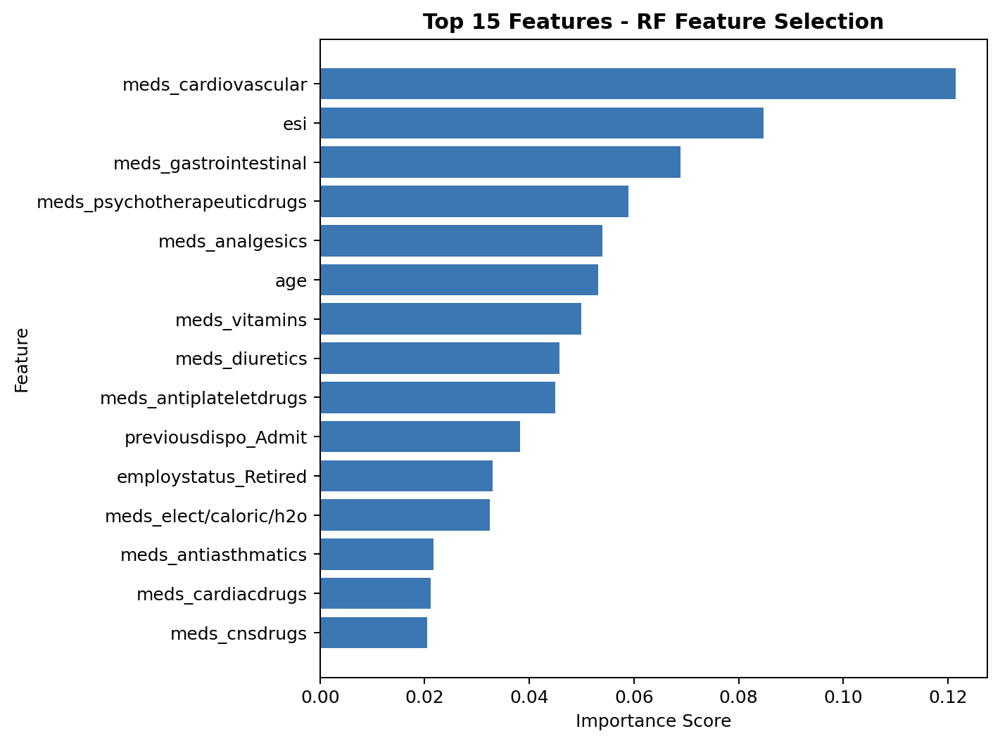
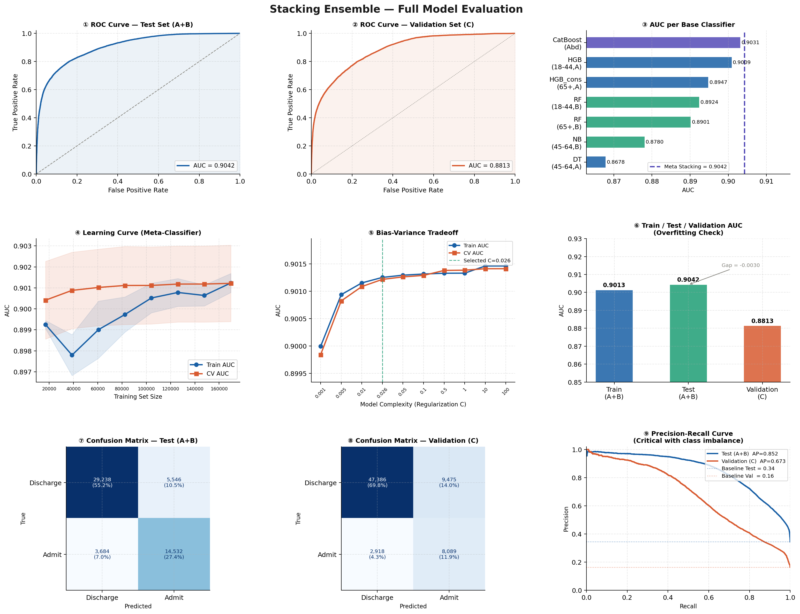
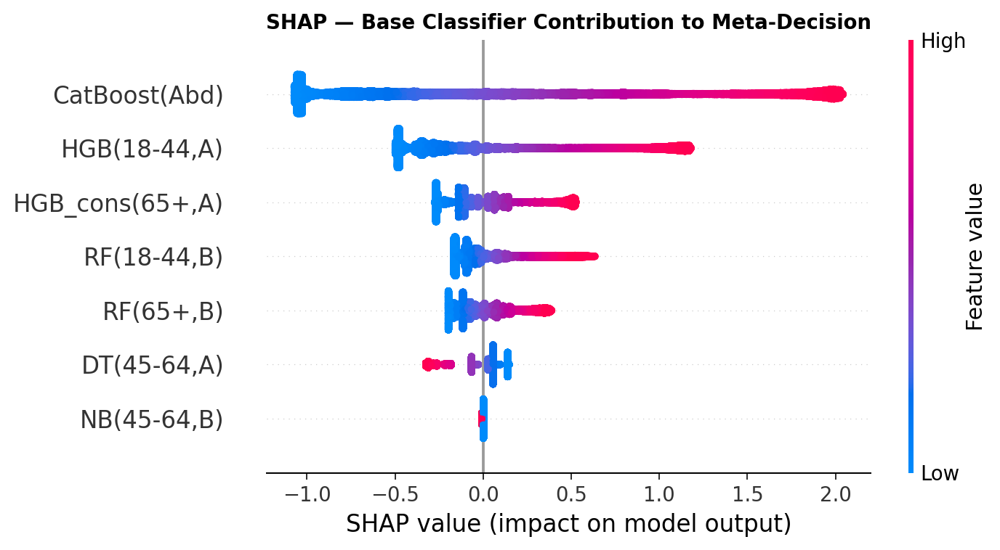

# Emergency Department Triage: Hospital Admission Prediction
### Stacking Ensemble with Demographic Specialists

A machine learning system that predicts, at the moment of triage, whether an ED patient will require hospital admission or be discharged. Built on the dataset from [Hong et al. (PLOS ONE, 2018)](https://doi.org/10.1371/journal.pone.0201016), this project extends the original work with a custom Stacking Ensemble architecture featuring demographic-specific specialists and out-of-hospital generalization evaluation.

---

## Dataset and Credits

This project uses the de-identified dataset from:

> Hong WS, Haimovich AD, Taylor RA (2018). *Predicting hospital admission at emergency department triage using machine learning.* PLOS ONE 13(7): e0201016.
> DOI: [10.1371/journal.pone.0201016](https://doi.org/10.1371/journal.pone.0201016)

### Data Access

The raw EHR data is not publicly available due to patient privacy regulations. A de-identified, processed version of the dataset used in the original study, along with the original R scripts, is available at:

[github.com/yaleemmlc/admissionprediction](https://github.com/yaleemmlc/admissionprediction)

The dataset files are not included in this repository. Download them from the link above and place them in the project root before running.

---

## License

This project's code is released under the MIT License. The dataset and original study materials are distributed under the Creative Commons Attribution License (CC BY 4.0), which permits unrestricted use, distribution, and reproduction in any medium, provided the original authors and source are credited.

---

## The Clinical Problem


Emergency departments operate under constant resource pressure. A patient who needs admission but gets sent home is a critical failure, a False Negative with real consequences. A patient admitted unnecessarily ties up a bed that someone else needs. This system attempts to navigate that tradeoff at the earliest possible decision point: **triage**.

The model uses only information available at triage time: vitals, chief complaint, ESI level, demographics, medication history, and prior hospital usage, to generate an admission probability before any lab results or physician evaluation.

The diagram above illustrates the triage workflow across the three hospitals in the dataset. A patient arrives by ambulance, walk-in, or car and is registered with administrative data. The chief complaint is recorded as binary flags, vital signs are measured, and a triage nurse assigns an ESI level from 1 to 5. Critical patients (ESI 1–2) are seen immediately, while non-critical patients (ESI 3–5) wait and have their medical history collected. The physician then makes the final admission decision — the variable this model is trained to predict.

---

## Architecture Overview



Rather than training a single model on all patients, this project uses a **Specialist Stacking Ensemble**: each base classifier is trained exclusively on a demographic subset defined by age group and hospital. A Logistic Regression meta-learner then learns how to combine their predictions.

The demographic splits were driven by data, not intuition. Admission rates differ meaningfully across groups:

| Age Group | Hospital A | Hospital B | Decision |
|-----------|-----------|-----------|----------|
| 18–44 | 17.3% | 11.1% | Separate specialists |
| 45–64 | 34.0% | 33.3% | Combined specialist |
| 65+ | 59.6% | 63.0% | Separate specialists |

A seventh specialist (CatBoost) was added after error analysis revealed a disproportionate share of False Negatives among patients presenting with abdominal pain, flank pain, back pain, or emesis.

### Base Classifiers

| Classifier | Subset |
|-----------|--------|
| HistGradientBoosting | 18–44, Hospital A |
| RandomForest | 18–44, Hospital B |
| DecisionTree | 45–64, Hospital A |
| GaussianNB | 45–64, Hospital B |
| HistGradientBoosting | 65+, Hospital A |
| RandomForest | 65+, Hospital B |
| CatBoost | Abdominal/GI complaints |

**Meta-Learner**: Logistic Regression (C=0.026, tuned via Optuna)

---

## Feature Selection Pipeline

Features were selected through three sequential filters:

1. **Low Variance Filter** removes near-constant features (threshold = 0.01)
2. **Correlation Filter** drops one from each pair with |corr| > 0.90
3. **Random Forest Importance** keeps features covering 90% of cumulative importance

**Final result: 30 features** from an original set of ~900+.



The top features align with the original paper's findings: ESI level, cardiovascular medications, age, gastrointestinal medications, and prior hospital disposition all rank among the most predictive variables, clinically interpretable signals of patient complexity and acuity.

---

## Out-of-Fold Stacking

Each base classifier generates predictions through **5-Fold Stratified Cross-Validation**. In each fold, the classifier trains on its demographic subset within the training folds and predicts for all patients in the hold-out fold, including patients outside its specialty. This prevents data leakage into the meta-learner's training set.

After the OOF loop completes, each classifier is refitted on its full subset for final inference.

---

## Results

### Test Set (Hospitals A + B)

| Metric | Value |
|--------|-------|
| AUC | **0.9042** |
| Weighted AUC (ESI) | 0.8856 |
| Admit Recall | 0.80 |
| Admit Precision | 0.72 |
| Train/Test AUC Gap | 0.0030 |

Decision threshold set to **0.30**, calibrated for clinical context where False Negatives carry 3–5x the cost of False Positives.

### Validation Set (Hospital C, Unseen)

| Metric | Value |
|--------|-------|
| AUC | **0.8813** |
| Weighted AUC (ESI) | 0.8636 |
| Admit Recall | 0.73 |
| Admit Precision | 0.46 |

Hospital C is a suburban free-standing department with a 15.6% admission rate, substantially lower than the ~30% seen during training. Despite this distribution shift, the model retained strong discriminative ability. Threshold lowered to **0.20** to compensate for the lower base rate.



---

## SHAP Explainability



SHAP analysis on the meta-learner reveals how much each specialist influences the final decision. CatBoost(Abd) shows the widest SHAP distribution and highest overall impact. The HGB specialists for the 18–44 and 65+ groups also contribute meaningfully. NB(45–64,B) and DT(45–64,A) show values concentrated near zero, indicating the meta-learner relies on them minimally.

---

## Key Design Decisions

**Why not a single model?** Admission behavior differs across demographic groups. A single model trained on everyone averages out these differences. Specialists exploit them.

**Why Logistic Regression as meta-learner?** It stays simple and interpretable, avoiding the risk of the meta-learner overfitting the OOF predictions. Lower C means stronger regularization and a more conservative combination of specialists.

**Why threshold 0.30 (and 0.20 for Hospital C)?** A False Negative in an ED context carries significantly higher clinical and financial cost than a False Positive. The thresholds reflect this asymmetry.

**Why 60% of the data?** Consistent with Hong et al.'s finding that models reach peak performance at ~50% of the training set. Memory constraints and diminishing returns made 60% the practical ceiling.

---

## Limitations

**Single-year window**: No seasonal validation. Winter patterns such as respiratory illness spikes may not generalize to other periods.

**Disposition as ground truth**: The model learns to predict what the hospital historically decided, not necessarily what the patient clinically needed. Systemic biases in admission decisions are absorbed by the model.

**Demographic disparities**: Hispanic/Latino patients show ~12–15% lower admission rates than non-Hispanic patients at the same ESI level. White patients show an admission rate of 41.3% versus 21–24% for all other groups, differences that likely reflect existing inequities in care delivery rather than clinical need alone.

**Static hyperparameters**: Optuna tuning was performed on an earlier version of the pipeline. The current hyperparameters are near-optimal but not guaranteed to be globally optimal for the final configuration.

---

## Setup

```bash
git clone https://github.com/agelosdav-lang/ED-Triage-Admission-ML.git
cd ED-Triage-Admission-ML

python -m venv venv
source venv/bin/activate        # Windows: venv\Scripts\activate

pip install -r requirements.txt
```

Then run:

```bash
python main.py
```

---

*Built as a course project in Machine Learning. All patient data is de-identified.*
